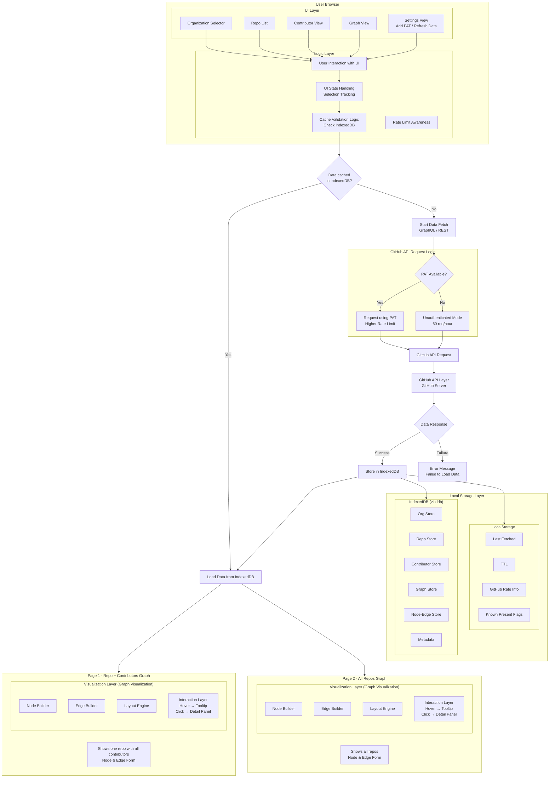

<div name="readme-top"></div>

<div align="center" style="display: flex; align-items: center; justify-content: center; gap: 16px;">
  
  
</div>

<div align="center">

# OrgExplorer

[](https://orgexplorer.aossie.org/)
[](https://discord.gg/hjUhu33uAn)
[](LICENSE)

</div>

---

**OrgExplorer** transforms GitHub organizations into interactive, visual intelligence dashboards. Explore repository relationships, contributor networks, activity trends, risk metrics, and organizational health—all without leaving your browser.

### Key Insights
- Repository relationship mapping
- Contributor collaboration networks
- Activity trends and growth patterns
- Bus factor & single-point-of-failure detection
- Technology stack distribution
- Real-time organizational metrics

---

##  Features

- **Fully Browser-Based** — Runs entirely in the browser with GitHub's REST API. No backend server required.

- **Organization Dashboard** — Overview of repositories, stars, contributors, creation timeline, tech stack, and activity metrics.

- **Repository Analytics** — Deep insights into repository health, commit frequency, contributor density, issue trends, and language composition.

- **Contributor Network Visualization** — Graph-based view of how contributors collaborate across repositories.

- **Bus Factor & Risk Detection** — Identify single points of failure and contributor concentration risks.

- **Activity & Growth Trends** — Track repository creation patterns, commit activity, and engagement over time.

- **Authenticated Mode** — Optional GitHub GraphQL API for enhanced data access and deeper analytics.

---

##  Tech Stack

**Frontend**: React 18 · TypeScript · TailwindCSS · Vite  
**Visualizations**: D3.js · Recharts  
**Data**: GitHub REST & GraphQL APIs  
**Storage**: IndexedDB (browser-based caching)  
**Build**: Vite with React plugin

---

##  Architecture



### System Structure

- Frontend (React + D3.js)
- Data Processing Layer (analytics engine)
- GitHub REST API
- Optional GitHub GraphQL API
- Database (IndexedDB for caching, local storage for user settings)
- UI Rendering Layer (dashboard, graphs, panels)

Data flows:

User → Frontend → API → GitHub APIs → Processing Layer → Database → UI Rendering

---

##  User Flow

```
User enters organization name
        ↓
REST API fetches public insights
        ↓
Analytics engine computes metrics
        ↓
Dashboard renders visual intelligence
        ↓
(Optional) User enables authenticated mode
```

### Quick Start

1. **Clone & Install**
   ```bash
   git clone https://github.com/AOSSIE-Org/OrgExplorer.git
   cd OrgExplorer
   npm install
   ```

2. **Run Development Server**
   ```bash
   npm run dev
   ```
   Open http://localhost:5173 in your browser.

3. **Build for Production**
   ```bash
   npm run build
   ```

For detailed setup instructions, see [CONTRIBUTING.md](./CONTRIBUTING.md).

---

##  Contributing

We welcome contributions from developers, designers, and open-source enthusiasts. See [CONTRIBUTING.md](./CONTRIBUTING.md) for:
- How to report bugs and suggest features
- Development workflow and coding standards
- Pull request guidelines
- Community communication


##  License

Licensed under the **GNU General Public License v3.0**. See [LICENSE](LICENSE) for details.

---

##  Acknowledgments

- AOSSIE Community
- GitHub API Documentation
- React, Vite, and D3.js communities

 2026 AOSSIE. All rights reserved.
